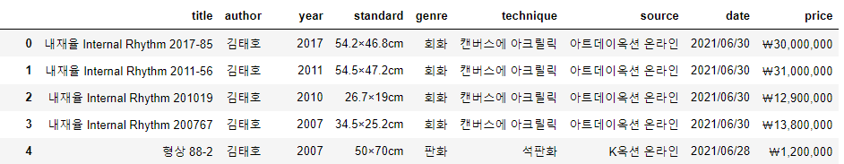
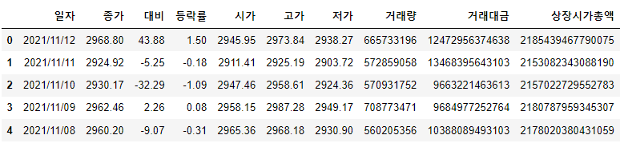
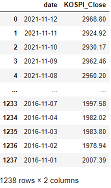
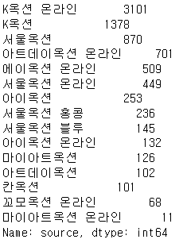

# Topic : '미술품이 갖는 특징과 경제적 지표를 고려한 국내 작가들의 미술품 경매 가격 예측'

### Researcher : 김종백, 한민아

# Data

1. Feature
    1. 미술품의 특징
        1. 작가, 재질, 제작연도, 규격, 장르, 기법, 거래일…
        2. K-artprice 사이트에서 크롤링 가능(로그인 필요)
        3. 
    2. 경제적 지표
        1. KOSPI, Bitcoin Price, 서울지역 부동산 매매 평균가격, 원달러 환율, 유가
            1. KOSPI : KRX 데이터센터에서 확보
            2. BTC Price
                1. 2017-09 ~ 2021-11-12까지의 Upbit BTC/KRW 가격
                2. 2016-01 ~ 2021-11-12까지의 Coinbase BTC/USD 가격
            3. 부동산 매매 지표 : KB 월간주택가격동향 데이터 참조
            4. 원달러 환율 : investing.kr 에서 확보
            5. 유가 : 서부텍사스산중질유(WTI) 선물 가격 확보
        2. 일별 데이터는 investing.kr 등에서 확보 가능
    
2. Label
    1. 낙찰 가격
    2. K-artprice에서 확인 가능

 

# Preprocessing

## 데이터 결합

- 시계열 데이터와 경매 낙찰 가격에 대한 데이터 결합 진행
- KOSPI, 부동산, WTI, 원달러 환율에 대한 데이터 결합 진행
- 비트코인 데이터는 국내 시장 데이터의 제일 오래된 데이터가 2017-05-25인데 경매 데이터는 2016년 데이터도 있어서 결합하지 않음

### KOSPI & WTI & 환율

```python
kospi = pd.read_csv('economic_historical_data/KOSPI_20160101~20211112.csv', encoding='cp949')
kospi.head()
```



```python
kospi.drop(['대비','등락률','시가','고가','저가','거래량','거래대금','상장시가총액'], axis='columns', inplace=True)

kospi = kospi.rename(columns={'일자': 'date', '종가':'KOSPI_Close'})
kospi['date'] = pd.to_datetime(kospi['date'])

kospi
```



```python
df = pd.merge(df, kospi, left_on='date', right_on='date', how='left')
```

### 부동산 데이터

- 온라인 상에서 배포되는 KB 월간주택가격동향 데이터를 참조함
- 각 연/월 별 전국 주택가격변동비율을 dict 형태로 생성

```python
estate_rate = {
    2016:{
        1:94.5, 2:94.6, 3:94.6, 4:94.7,
        5:94.7, 6:94.8, 7:94.9, 8:95.1,
        9:95.2, 10:95.4, 11:95.7, 12:95.7
    },
    2017:{
        1:95.7, 2:95.8, 3:95.8, 4:95.8,
        5:95.9, 6:96.0, 7:96.3, 8:96.5,
        9:96.6, 10:96.7, 11:96.8, 12:96.9,
    },
    2018:{
        1:97.1, 2:97.3, 3:97.5, 4:97.7,
        5:97.8, 6:97.9, 7:98.0, 8:98.2,
        9:99.2, 10:99.8, 11:99.9, 12:100.0,
    },
    2019:{
        1:100.0, 2:99.9, 3:99.83, 4:99.7,
        5:99.6, 6:99.5, 7:99.5, 8:99.6,
        9:99.6, 10:99.7, 11:99.9, 12:100.2,
    },
    2020:{
        1:100.6, 2:100.9, 3:101.5, 4:101.7,
        5:101.9, 6:102.4, 7:103.3, 8:104.1,
        9:104.9, 10:105.6, 11:107.1, 12:108.6,
    },
    2021:{
        1:109.9, 2:111.4, 3:112.8, 4:114.0,
        5:115.1, 6:116.6, 7:118.0, 8:119.8,
        9:121.6, 10:122.9
    }
}
```

- 데이터와 연을 입력하면 해당 월에 해당하는 주택가격변동비율을 반환하는 함수 생성

```python
def find_month(i, year):
    if df['date'][i].month == 1:
        return estate_rate[year][1]
    elif df['date'][i].month == 2:
        return estate_rate[year][2]
    elif df['date'][i].month == 3:
        return estate_rate[year][3]
    elif df['date'][i].month == 4:
        return estate_rate[year][4]
    elif df['date'][i].month == 5:
        return estate_rate[year][5]
    elif df['date'][i].month == 6:
        return estate_rate[year][6]
    elif df['date'][i].month == 7:
        return estate_rate[year][7]
    elif df['date'][i].month == 8:
        return estate_rate[year][8]
    elif df['date'][i].month == 9:
        return estate_rate[year][9]
    elif df['date'][i].month == 10:
        return estate_rate[year][10]
    elif df['date'][i].month == 11:
        return estate_rate[year][11]
    elif df['date'][i].month == 12:
        return estate_rate[year][12]
```

## 데이터 결측치 제거

### standard 

- 넓이가 없는 데이터가 3개 있어 drop 처리함

- 가로 x 세로 형태의 데이터가 아닌 경우 drop 처리함
    - 한 경매 거래에 서로 다른 여러 작품을 한 번에 거래하는 경우
    - 넓이가 아닌 부피의 개념이 도입되어야 하는 경우(도자기 등)

## 데이터 범주 기준 정의

### Author

```python
df['author'] = df['author'].map({
    '김환기' : 0, '이우환' : 1, '박서보' : 2, '정상화' : 3, '김창열' : 4, '박수근' : 5, '천경자' : 6, 
    '이중섭' : 7, '윤형근' : 8, '이대원' : 9, '유영국' : 10, '장욱진' : 11, '김종학' : 12, '백남준' : 13, 
    '오치균' : 14, '하종현' : 15, '도상봉' : 16, '이강소' : 17, '이왈종' : 18, '정선' : 19, '김홍도' : 20, 
    '김태호' : 21, '이상범' : 22, '남관' : 23, '이응노' : 24, '전광영' : 25, '김정희' : 26, '서세옥' : 27, 
    '이성자' : 28, '김기창' : 29})
```

### Standard

- 해당 작품의 가로와 세로를 곱한 값인 넓이 column을 만듦

### Genre

```python
df = df.replace(['회화', '판화', '서예', '서예-현판', '기타', '입체', '공예', '사진/미디어', '공예-도자기'],[0,1,2,3,4,5,6,7,8])
```

### Technique

- 같은 재질을 사용하지만 표현하는 방식이 다른 경우 같은 표현 방식으로 replace하는 사용자 사전을 제작함

    - ```python
        tech_dictionary = {
            '프린트': '종이', '스크린':'종이', '부채': '종이', '탁본' : '종이', '인쇄':'종이', '지본묵서': '종이',
            '판화': '종이', '접선':'종이', '지본수묵':'종이', '포스터':'종이','장지': '종이', '신문': '종이', 
            '지도':'종이', '카드보드':'하드보드', '드라이포인트': '금속', '아쿼틴트': '금속', '에칭': '금속',
            '믹소그라피아': '금속','믹소그라피': '금속', '믹소그래프': '금속','디아섹': '아크릴', '천': '직물', 
            '비단': '직물', '세리그라프': '직물','세리그래프':'직물','에코백': '직물', '면': '직물', '견': '직물', 
            '마포': '직물', '마대': '직물', '모시': '직물', '린넨': '직물', '금견': '직물', '코튼': '직물', 
            '도자에': '세라믹', '도자기': '세라믹', '목판인쇄본': '나무', '켄버스':'캔버스', '그라파이트' : '흑연',
            '나뭇잎' : '낙엽',  '먹' : '수묵','수묵채색' : '수묵담채','유채':'유화 채색'}
        ```

- 선행 연구를 참조하여 base_material(바탕재)와 material(재료)로 구분

    - ```python
        base_material = ['목탄', '종이',  '직물',  '캔버스', '하드보드', '한지', 
                         '세라믹', '테라코타', '메소나이트', '나무', '낙엽', '은지', '금속']
        
        material = ['과슈', '마카', '매직', '사인펜', '색연필', '수묵', '수묵담채', '수채', '연필', '유화', '잉크', 
                    '채색', '펜', '혼합재료', '안료', '그라파이트', '아크릴', '콩테', '콜라주', '새김', 
                    '크레파스', '에나멜', '오일파스텔']
        ```

- 각 작품의 제작 방식의 텍스트를 참조하여, base_material / material의 단어가 포함될 때마다 해당 material에 해당하는 column의 값을 1로 변경함. 해당 material과 무관한 경우 0으로 유지하는 이진 분류 방식 채택

    - ```python
        for i in range(0, len(df_copy)):
            text = str(df_copy['technique'][i])
            for j in range(0, len(arr)):
                if arr[j] in text:
                    df_copy[tech_iter[j]][i]=1
                    continue
        ```

### Source

```python
df['source'].value_counts()
```



- 옥션업체 명과 온라인을 구분하여 Source 데이터로 2개의 Column을 만듦.
    - 기존 옥션업체 명칭에 해당하는 Source : 범주형 데이터
    - 온라인 여부를 판단하는 online : 이진 데이터

### Price

```python
for i in range(0, len(df)):
    text = df['price'][i]
    text = text.replace('￦','')
    text=  text.replace(',', '')
    df['price'][i] = text
df['price']
```

- 원화 표시와 반점을 제거

### Year

- 일반적인 규칙

    - ~ 처리된 것은 맨 마지막 값을 제작연도로 계산함. 
        - Ex.1993~95 면 1995가 됨
    - 월/일이 표시된 것은 해당 연도를 제작연도로 계산함.
        - Ex.1997.10면 1997이 됨
    - , 처리된 것은 큰 값을 제작연도로 계산함
        - Ex. 1995, 1996이면 1996이 됨
    - ~년대 인 경우 해당 시대의 맨 마지막 연도로 계산함. 
        - Ex. 1980년대 면 1989년이 됨
    - ~년경 인 경우 해당 연도를 제작연도로 계산함 
        - Ex. 1991년경 이면 1991년이 됨
    - 연도에 문자가 섞인 경우 문자를 제거 
        - Ex. b.1998면 1998년이 됨
    - 연도 미상인 것들이 많고 작가의 생몰년도가 정확한 경우 작가의 사망연도를 제작연도로 함. 
        - Ex. 정선의 사망연도가 1759년이므로 정선 작품 중 제작연도를 알 수 없는 것들은 모두 1759년으로 함.

- 결측치

    - 해당 작가가 출품한 작품이 제일 많은 해의 연도를 삽입할 예정

- 결측치에 삽입할 연도를 찾는 코드

    - ```python
            di = dict(df[df['author']==author]['year'].value_counts())
            max_year = str(max(di, key=di.get))
            if author==19:
                max_year = 1759 # 정선 사망 연도가 1759
            elif author==26:
                max_year = 1856 # 김정희 사망 연도가 1856
            elif '년대' in max_year:
                max_year = int(max_year[:3]+'9')
            else:
                max_year = int(max_year)
        ```

- 그 밖의 일반적인 연도 처리를 하는 코드

    - ```python
        for _ in range(0, len(df[df['author']==author]['year'])):
                year_text = str(df[df['author']==author]['year'][row_count])
                if len(year_text)==3:
                    year = max_year
                elif '~' in year_text:
                    year = year_text.split('~')[0][:2]+year_text.split('~')[1][:2]
                elif '/' in year_text:
                    year = year_text[:4]
                elif '.' in year_text:
                    year = year_text[:4]
                elif ',' in year_text:
                    year = max(list(year_text.split(',')))
                elif '년대 초반' in year_text:
                    year = year_text[:3]+'2'    
                elif '년대 중반' in year_text:
                    year = year_text[:3]+'6'
                elif '년대 후반' in year_text:
                    year = year_text[:3]+'9'
                elif '년대' in year_text:
                    year = year_text[:3]+'9'
                elif '년경' in year_text:
                    year = year_text[:4]
                elif 'a' in year_text or 'b' in year_text or 'c' in year_text:
                    year = year_text[2:]
                elif '세기' in year_text:
                    year = int(year_text.split('세기')[0])*100+150
                elif '(' in year_text:
                    year = year_text[:4]
                else:
                    year = int(year_text)
                df['year'][row_count] = year
                row_count+=1
        ```

# Modeling

